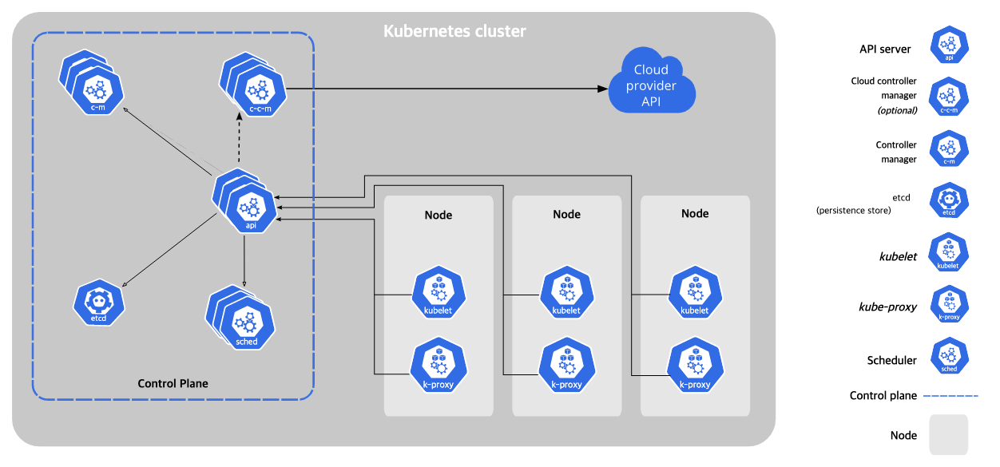
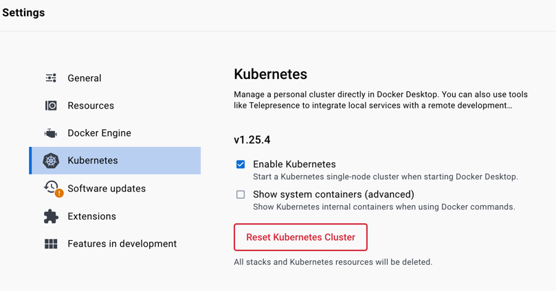

1주차 - 쿠버네티스 설치 및 API 사용해보기
===
---
Kubernetes Architecture
---


`Docker Desktop`으로 간단하게 설치
---
- Docker Desktop을 이용해서 간단하게 쿠버네티스 서버를 설치할 수 있음.
1. Docker Desktop 설치
    ```bash
    > brew install --cask docker
    ```

2. Docker Desktop App 실행

3. Settings > Kubernetes > Enable Kubernetes > Apply
   

4. Docker Desktop 재실행

Kubernetes API 콜 해보기
---
> 쿠버네티스는 `kubectl` cli 명령어로 조작이 가능하며
> `kubectl` 명령어는 내부적으로 config 파일에 설정된 인증서들을 이용하여 http API 콜을 진행한다.
> 
> `kubectl` 명령어가 아니라 서버로 직접 API 콜을 날려보도록 하자.

- 기본적으로 쿠버네티스에 대한 설정 정보는 `~/.kube` 폴더에 `config` 파일에 작성된다.
- cluster와 https 통신을 하기 위한 인증서 키, 유저에 대한 인증 키들을 base64 인코딩하여 작성한다.
    ```yaml
    # ~/.kube/config
    apiVersion: v1
    clusters:
      - cluster:
          certificate-authority-data: LS0tL...
          server: https://kubernetes.docker.internal:6443
        name: docker-desktop
    contexts:
      - context:
          cluster: docker-desktop
          user: docker-desktop
        name: docker-desktop
    current-context: docker-desktop
    kind: Config
    preferences: {}
    users:
      - name: docker-desktop
        user:
          client-certificate-data: LS0tLS...
          client-key-data: LS0tLS1CR...
    ```

- 인증서 파일을 생성하고 https 요청을 진행해보자.
    ```bash
    kubectl config view --minify --raw --output 'jsonpath={..cluster.certificate-authority-data}' | base64 -d > ~/docker-desktop-ca.crt
    kubectl config view --minify --raw --output 'jsonpath={..user.client-key-data}' | base64 -d > user.key
    kubectl config view --minify --raw --output 'jsonpath={..user.client-certificate-data}' | base64 -d > user.crt

    curl --cacert docker-desktop-ca.crt --cert user.crt --key user.key https://127.0.0.1:6443
    ```


Kubernetes 서비스 계정 만들기
---
> 처음 쿠버네티스 클러스터를 설치하면 기본적으로 관리자 레벨의 default 계정이 생성된다.
> 
> 관리자 계정 이외에 다른 서비스 계정을 생성해보자.

0. 서비스 계정 조회
    ```bash
    kubectl get serviceaccounts
    # NAME      SECRETS   AGE
    # default   0         26m
    ```

1. 서비스 계정 생성
    ```bash
    kubectl create serviceaccount yuna
    ```
   - 아무런 역할이 지정되지 않은 계정이 생성된다. Role을 생성하고 Binding을 진행해주도록 하자.
2. Role yml 파일 작성
    ```yaml
   # yuna-role.yml
    apiVersion: rbac.authorization.k8s.io/v1
    kind: Role
    metadata:
    namespace: default
    name: service-reader
    rules:
    - apiGroups: [""] # 대상이 될 오브젝트 API 그룹, kubectl api-resources
      resources: ["services"] # 대상이 될 오브젝트
      verbs: ["get", "list"] # 허용할 동작
    ```
3. Role 생성
    ```bash
    kubectl apply -f yuna-role.yml
    ```
4. Role Binding yml 파일 작성
    ```yaml
    # service-reader-role-binder.yml
    apiVersion: rbac.authorization.k8s.io/v1
    kind: RoleBinding
    metadata:
      namespace: default
      name: service-reader-rolebinding
    subjects: # 누구에게
    - kind: ServiceAccount # 권한 부여 오브젝트
      name: yuna # 계정 명
      namespace: default
    roleRef:  # 어떤 롤을
      kind: Role # Role에 
      name: service-reader # service-reader로 명명된 Role 을 부여 하겠다.
      apiGroup: rbac.authorization.k8s.io
    ```
5. Binding
    ```bash
    kubectl apply -f service-reader-role-binder.yml
    ```
6. 생성된 계정으로 서비스 조회해보기
    ```bash
    kubectl get services --as system:serviceaccount:default:yuna
    ```
! 과제 ! ClusterRole을 가진 계정을 생성해보자.
---
