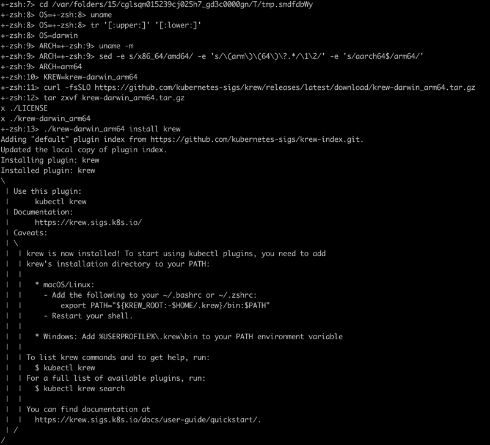
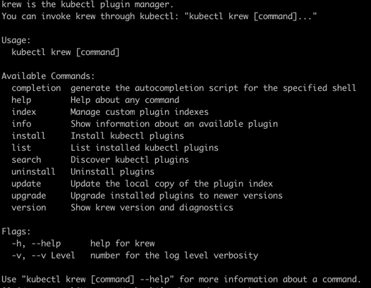
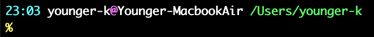
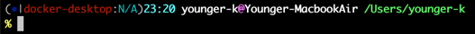

2주차 - Kubernetes Plugins & Pod 생성
===
---
Kubernetes Plugins
--
### Krew
- 쿠버네티스의 Plugin Manager
- [Krew Document](https://krew.sigs.k8s.io/)

#### Install
> Mac OS 기준. git이 미리 설치되어 있어야 한다. 

1. 터미널에서 Command 수행 
    ```bash
    (
      set -x; cd "$(mktemp -d)" &&
      OS="$(uname | tr '[:upper:]' '[:lower:]')" &&
      ARCH="$(uname -m | sed -e 's/x86_64/amd64/' -e 's/\(arm\)\(64\)\?.*/\1\2/' -e 's/aarch64$/arm64/')" &&
      KREW="krew-${OS}_${ARCH}" &&
      curl -fsSLO "https://github.com/kubernetes-sigs/krew/releases/latest/download/${KREW}.tar.gz" &&
      tar zxvf "${KREW}.tar.gz" &&
      ./"${KREW}" install krew
    )
    ```
    
   
2.  ~/.zshrc 파일에 PATH 환경변수 추가.
    ```bash
    export PATH="${KREW_ROOT:-$HOME/.krew}/bin:$PATH"
    ```
3. 설치 확인
    ```bash
    kubectl krew
    ```
   

#### 필수 플러그인
```bash
kuberctl krew install {플러그인이름}
```
1. ctx
   - 쿠버네티스 컨텍스트 관련 플러그인
   ```bash
   # 컨텍스트 목록 확인
   kubectl ctx
   
   # 컨텍스트 변경
   kubectl ctx {컨텍스트명}
   
   # 이전 컨텍스트로 변경
   kubectl ctx -
   ```
2. ns
   - 쿠버네티스 네임스페이스 관련 플러그인
   ```bash
   # 네임스페이스 목록 확인
   kubectl ns
   
   # 네임스페이스 변경
   kubectl config set-context --current --namespace={네임스페이스명} # 원래 명령어
   kubectl ns {네임스페이스명} # 플러그인으로 줄어든 명령어
   
   # 이전 네임스페이스로 변경
   kubectl ns -
   ```

### kube-ps1
- 터미널에서 현재 쿠버네티스의 선택된 컨텍스트와 네임스페이스를 볼 수 있게 해주는 플러그인.
- [kube-ps1 github](https://github.com/jonmosco/kube-ps1)
- `brew`를 이용해서 간편하게 설치 가능
   ```bash
   brew install kube-ps1
   ```
   ```bash
   #~/.zshrc 파일에 추가
   source "/opt/homebrew/opt/kube-ps1/share/kube-ps1.sh"
   PS1='$(kube_ps1)'$PS1
   ```

- before

   

- after

  

Pod 생성
---
