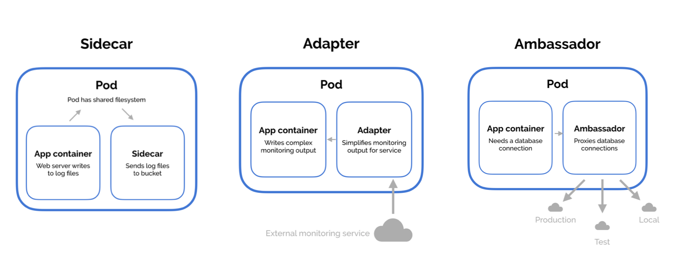

2주차 - Kubernetes Plugins & Pod 생성
===
---
Kubernetes Plugins
--
### Krew
- 쿠버네티스의 Plugin Manager
- [Krew Document](https://krew.sigs.k8s.io/)

#### Install
> Mac OS 기준. git이 미리 설치되어 있어야 한다. 

1. 터미널에서 Command 수행 
    ```bash
    (
      set -x; cd "$(mktemp -d)" &&
      OS="$(uname | tr '[:upper:]' '[:lower:]')" &&
      ARCH="$(uname -m | sed -e 's/x86_64/amd64/' -e 's/\(arm\)\(64\)\?.*/\1\2/' -e 's/aarch64$/arm64/')" &&
      KREW="krew-${OS}_${ARCH}" &&
      curl -fsSLO "https://github.com/kubernetes-sigs/krew/releases/latest/download/${KREW}.tar.gz" &&
      tar zxvf "${KREW}.tar.gz" &&
      ./"${KREW}" install krew
    )
    ```
    
   
2.  ~/.zshrc 파일에 PATH 환경변수 추가.
    ```bash
    export PATH="${KREW_ROOT:-$HOME/.krew}/bin:$PATH"
    ```
3. 설치 확인
    ```bash
    kubectl krew
    ```
   

#### 필수 플러그인
```bash
kuberctl krew install {플러그인이름}
```
1. ctx
   - 쿠버네티스 컨텍스트 관련 플러그인
   ```bash
   # 컨텍스트 목록 확인
   kubectl ctx
   
   # 컨텍스트 변경
   kubectl ctx {컨텍스트명}
   
   # 이전 컨텍스트로 변경
   kubectl ctx -
   ```
2. ns
   - 쿠버네티스 네임스페이스 관련 플러그인
   ```bash
   # 네임스페이스 목록 확인
   kubectl ns
   
   # 네임스페이스 변경
   kubectl config set-context --current --namespace={네임스페이스명} # 원래 명령어
   kubectl ns {네임스페이스명} # 플러그인으로 줄어든 명령어
   
   # 이전 네임스페이스로 변경
   kubectl ns -
   ```

### kube-ps1
- 터미널에서 현재 쿠버네티스의 선택된 컨텍스트와 네임스페이스를 볼 수 있게 해주는 플러그인.
- [kube-ps1 github](https://github.com/jonmosco/kube-ps1)
- `brew`를 이용해서 간편하게 설치 가능
   ```bash
   brew install kube-ps1
   ```
   ```bash
   #~/.zshrc 파일에 추가
   source "/opt/homebrew/opt/kube-ps1/share/kube-ps1.sh"
   PS1='$(kube_ps1)'$PS1
   ```

- before

   

- after

  

Pod 생성
---
### Pod?
- 쿠버네티스에서 배포 가능한 가장 작은 컴퓨팅 단위
- 컨테이너 애플리케이션의 기본 단위
  - 도커 엔진에서는 도커 컨테이너, 스웜 모드에서는 여러 개의 컨테이너로 구성된 서비스(service)가 기본 단위.
- 파드 안에 여러개의 컨테이너가 가능하나 보통 하나만 둠. 
  - cf. side car pattern?
    
    - 하나의 파드에 메인 컨테이너를 더럽히기 싫을 때 사용
    - 서브로 로그를 처리하거나 파드 내 로컬 캐시용으로 쓰는듯 함.

### Pod를 만들어보자.
```yaml
# my-nginx-pod.yml
apiVersion: v1
kind: Pod # api-resource 종류
metadata: # 라벨, 주석, 이름 등과 같은 리소스의 부가 정보 입력.
  name: my-nginx-pod
spec: # 리소스를 생성하기 위한 자세한 정보 입력.
  containers: # 컨테이너 정보 정의
  - name: my-nginx-container
    image: nginx:latest
    ports:
    - containerPort: 80
      protocol: TCP
```

```bash
kubectl apply -f my-nginx-pod.yml # 파드 생성
# pod/my-nginx-pod created

kgp # 파드 조회
# NAME       READY   STATUS    RESTARTS   AGE
# my-nginx-pod   1/1     Running   0          34s

kubectl describe pods my-nginx-pod
#Name:             my-nginx-pod
#Namespace:        default
#Priority:         0
#Service Account:  default
#Node:             docker-desktop/192.168.65.4
#Start Time:       Mon, 29 May 2023 21:19:02 +0900
#Labels:           <none>
#Annotations:      <none>
#Status:           Running
#IP:               10.1.0.26
#IPs:
#  IP:  10.1.0.26
#Containers:
#  my-nginx-container:
# ...

kubectl exec -it my-nginx-pod /bin/bash # 쉘 접속 

root@my-nginx-pod:/# curl http://10.1.0.26 # nginx 실행 확인
#<!DOCTYPE html>
#<html>
#<head>
#<title>Welcome to nginx!</title>
#<style>
#....
```

- 기본적으로 호스트와 격리된 상태로 pod가 생성됨.
```bash
curl http://10.1.0.26
# curl: (28) Failed to connect to 10.1.0.26 port 80 after 75008 ms: Couldn't connect to server
# 파드는 만들어졌지만 답이 돌아오지 않는다...
```
- 같은 네임스페이스 내 pod간 네트워크 공유는 가능하다.
```bash
# 같은 네임스페이스에 테스트용 curl 이미지 컨테이너 설치 후 쉘 접속.
kubectl run curl -it --rm --image=curlimages/curl sh

/ $ curl http://10.1.0.26 # 요청하면 nginx 페이지 확인 가능!
```


과제) 플러그인 조사해보기
--
