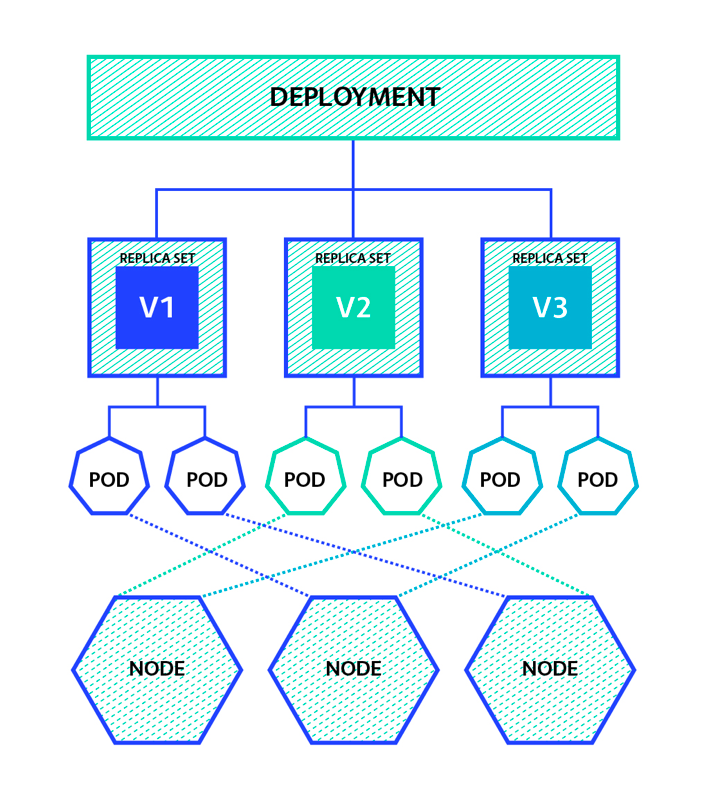

4주차 - Deployment
==
---

레플리카셋의 한계
--
- replicatSet의 개수 변경은 바로 적용이 되나, version 변경과 같은 파드 내부 스펙 변경은 자동으로 반영해주지 않음.
  - 한번 pod 죽였다가 다시 켜야하는 불편함 존재.
    ```bash
    kubectl delete pods --all
    ```

Deployment
--



- 파드와 레플리카셋에 대한 선언적 업데이트 가능.
  - 즉, 레플리카셋의 한계를 극복
- 단, 파드 템플릿(`.spec.templete`)이 변경된 경우에만 롤아웃이 실행됨.
  - 예를 들어, 템플릿의 레이블이나 컨테이너 이미지가 업데이트된 경우.
  - 디플로이먼트의 스케일링과 같은 다른 업데이트는 롤아웃을 트리거하면 안됨
  
```yaml
# nginx-deployment.yml
apiVersion: apps/v1
kind: Deployment
metadata:
  name: my-nginx-deployment
spec:
  replicas: 3
  selector:
    matchLabels:
      app: my-nginx-pod
  template:
    metadata:
      labels:
        app: my-nginx-pod
    spec:
      containers:
        - name: nginx
          image: nginx:latest
          ports:
            - containerPort: 80
```
- 기본적으로 레플리카셋 선언과 동일. kind를 Deployment로 명시. 
```bash
kubectl apply -f nginx-deployment
#deployment.apps/my-nginx-deployment created

kubectl get all
#NAME                                       READY   STATUS              RESTARTS   AGE
#pod/my-nginx-deployment-66477d7974-6p5bx   0/1     ContainerCreating   0          8s
#pod/my-nginx-deployment-66477d7974-9plw6   0/1     ContainerCreating   0          8s
#pod/my-nginx-deployment-66477d7974-ctrqq   0/1     ContainerCreating   0          8s
#
#NAME                 TYPE        CLUSTER-IP   EXTERNAL-IP   PORT(S)   AGE
#service/kubernetes   ClusterIP   10.96.0.1    <none>        443/TCP   27d
#
#NAME                                  READY   UP-TO-DATE   AVAILABLE   AGE
#deployment.apps/my-nginx-deployment   0/3     3            0           8s
#
#NAME                                             DESIRED   CURRENT   READY   AGE
#replicaset.apps/my-nginx-deployment-66477d7974   3         3         0       8s    -> 설정 파일대로 replicaset이 생성됨. 
```

- yml파일 변경 후 적용 시, 자동으로 롤링 업데이트를 진행해준다.
  > 위 예제 yml에서 nginx version을 latest -> 1.25.0으로 변경하여 적용해보자.

  ```yaml
  # 생략...
      spec:
      containers:
        - name: nginx
          image: nginx:latest
          ports:
            - containerPort: 80
  ```

  ```yaml
  kubectl apply -f nginx-deployment.yml
  #deployment.apps/my-nginx-deployment configured
  
  kubectl get pods -w # watch 옵션 적용.
  #NAME                                   READY   STATUS              RESTARTS   AGE
  #my-nginx-deployment-66477d7974-6p5bx   1/1     Running             0          5m30s
  #my-nginx-deployment-66477d7974-ctrqq   1/1     Running             0          5m30s
  #my-nginx-deployment-69ffccd6c-prhkm    1/1     Running             0          9s
  #my-nginx-deployment-69ffccd6c-vq7lr    0/1     ContainerCreating   0          3s
  #my-nginx-deployment-69ffccd6c-vq7lr    1/1     Running             0          5s
  #my-nginx-deployment-66477d7974-ctrqq   1/1     Terminating         0          5m32s
  #my-nginx-deployment-69ffccd6c-trj7p    0/1     Pending             0          0s
  #my-nginx-deployment-69ffccd6c-trj7p    0/1     Pending             0          0s
  #my-nginx-deployment-69ffccd6c-trj7p    0/1     ContainerCreating   0          0s
  #my-nginx-deployment-66477d7974-ctrqq   0/1     Terminating         0          5m33s
  #my-nginx-deployment-66477d7974-ctrqq   0/1     Terminating         0          5m33s
  #my-nginx-deployment-66477d7974-ctrqq   0/1     Terminating         0          5m33s
  #my-nginx-deployment-69ffccd6c-trj7p    1/1     Running             0          6s
  #my-nginx-deployment-66477d7974-6p5bx   1/1     Terminating         0          5m38s
  #my-nginx-deployment-66477d7974-6p5bx   0/1     Terminating         0          5m39s
  #my-nginx-deployment-66477d7974-6p5bx   0/1     Terminating         0          5m39s
  #my-nginx-deployment-66477d7974-6p5bx   0/1     Terminating         0          5m39s
  ```
  - pod를 하나씩 죽이면서 rolling update 진행. (default = rolling update)
  - 무중단 배포가 가능해짐. Good

  > 이미지 버전 뿐만 아니라, 레이블 셀렉터 스펙도 변경이 가능하나 일반적으로 권장되지 않음.
  > 
  > API 버전 apps/v1 에서 디플로이먼트의 레이블 셀렉터는 생성 이후에는 변경할 수 없음.

### Deployment Strategy
- `.spec.strategy.type` 옵션으로 배포 전략을 설정 가능.
  - Recreate : 한꺼번에 다 죽이고 다시 살림. 무중단 배포가 필요없는 개발환경 사용.
  - RollingUpdate : 파드를 일부만 죽이고 다시 살림. 운영환경에서 사용. 리소스 이슈가 발생할 수 있음.

#### RollingUpdate Options

1. Max Unavailable
   - `.spec.strategy.rollingUpdate.maxUnavailable`
   - value는 절대 숫자(ex. 5) 또는 파드 비율(ex. 10%)로 설정 가능.
   - 롤링 업데이트 프로세스 중에 사용할 수 없는 최대 파드의 수를 지정.
   - 기존 파드 삭제 후 새 파드를 생성하는 전략으로 수행됨.

2. Max Surge
   - `.spec.strategy.rollingUpdate.maxSurge`
   - value는 절대 숫자(ex. 5) 또는 파드 비율(ex. 10%)로 설정 가능.
   - 롤링 업데이트 프로세스 중에 최대로 추가할 수 있는 파드 수를 지정.
   - 새 파드를 생성 후 기존 파드를 삭제하는 전략으로 수행됨.

### Revision
- deployment 롤아웃 기록에 기반하여 버전관리 기능을 제공.
- 새로운 배포 버전이 문제가 있을 경우, 자동으로 이전 버전으로 롤백.
```bash
kubectl rollout history deployment my-nginx-deployment
#REVISION  CHANGE-CAUSE
#1         <none>
#2         <none>
#3         <none>
```
- `CHANGE_CAUSE`는 kubectl annotate 명령어로 따로 현재 버전에 대해 주석을 남겨주어야함!
  ```bash
  kubectl annotate deployments.apps my-nginx-deployment kubernetes.io/change-cause="nginx version updated to 1.25.0"
  ```

#### undo

- 당시 버전의 replicas는 반영이 안됨.
- hash값으로 replicaset을 찾아감.
- replicaset의 컨테이너 스펙 버전이라고 생각하면됨. 레플리카셋 날리면 전부 리비전도 날라감.

```bash
kubectl rollout undo deployment my-nginx-deployment --to-revision=2
```


숙제) 디플로이먼트 하위 옵션 조사하기
--