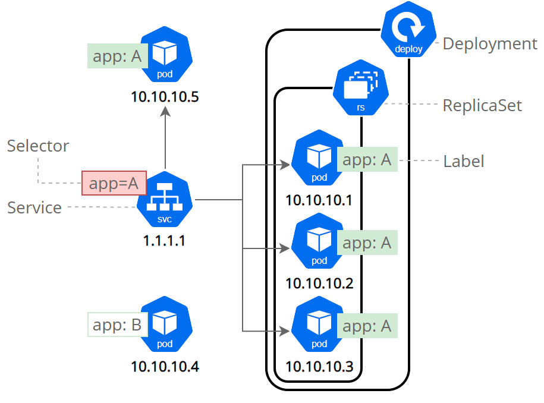
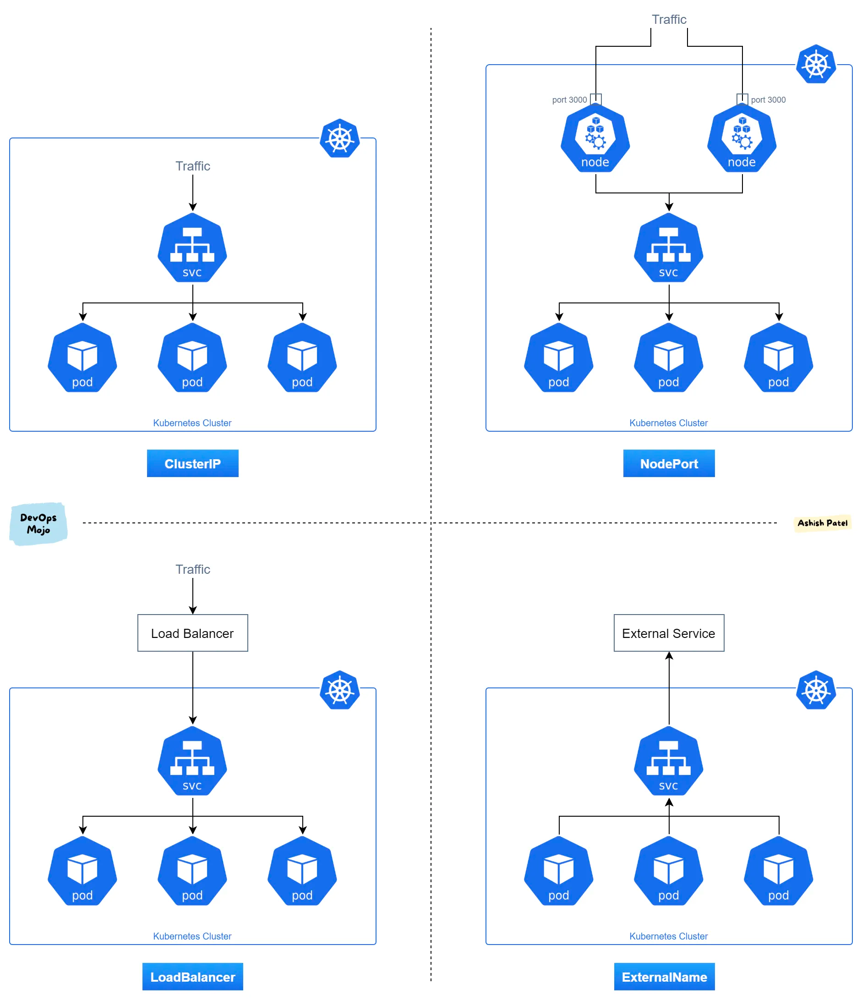

5주차 - Service 
==
---


- 파드 집합에서 실행중인 애플리케이션을 네트워크 서비스로 노출
  - 외부 네임스페이스에서 네트워크 통신을 하려면 파드로 바로 들어가진 않고 서비스를 거침.
- 파드 집합에 대한 단일 DNS 명을 부여하고 파드간 로드 밸런싱이 가능하다.

서비스 정의
--

### 기본 정의

```yaml
apiVersion: v1
kind: Service
metadata:
  name: my-service
spec:
  selector:
    app: MyApp
  ports:
    - protocol: TCP
      port: 80
      targetPort: 9376
```
- `spec.selector`
  - 서비스와 연결시킬 파드 그룹을 지정 가능.
- `spec.ports`
  - `targetPort`
    - 서비스와 연결시킬 파드의 포트.
    - 기본적으로 포트 번호로 참조가 가능하고 파드의 포트 정의에 있는 이름(`spec.containers.ports.name`)으로도 매핑이 가능하다.
  - `port`: 서비스의 포트 정의.
    - 서비스는 모든 수신 `port`를 `targetPort`와 매핑이 가능하나 기본적으로 `targetPort` 는 `port` 필드와 같은 값으로 설정된다.

### 멀티 포트 서비스 정의
```yaml
apiVersion: v1
kind: Service
metadata:
  name: my-service
spec:
  selector:
    app: MyApp
  ports:
    - name: http
      protocol: TCP
      port: 80
      targetPort: 9376
    - name: https
      protocol: TCP
      port: 443
      targetPort: 9377
```
- 위와 같은 형식인 멀티 포트 정의도 가능하다.


서비스 타입
--



### ClusterIP

- default
- 서비스를 클러스터 내부 IP에 노출시킨다.
- 클러스터 내에서만 서비스에 도달이 가능.


### NodePort

```yaml
apiVersion: v1
kind: Service
metadata:
  name: my-service
spec:
  type: NodePort # type 명시
  selector:
    app: MyApp
  ports:
      # 기본적으로 그리고 편의상 `targetPort` 는 `port` 필드와 동일한 값으로 설정된다.
    - port: 80
      targetPort: 80
      # 선택적 필드
      # 기본적으로 그리고 편의상 쿠버네티스 컨트롤 플레인은 포트 범위에서 할당한다(기본값: 30000-32767)
      nodePort: 30007
```

- 호스트(클러스터 외부)와 쿠버네티스를 연결해줌.
- 자유롭게 자체 로드밸런싱 솔루션을 설정이 가능하다.
- 거의 `dev`에서만 씀
- port range : 30000 ~ 32767

### LoadBalancer

```yaml
apiVersion: v1
kind: Service
metadata:
  name: my-service
spec:
  selector:
    app: MyApp
  ports:
    - protocol: TCP
      port: 80
      targetPort: 9376
  clusterIP: 10.0.171.239
  type: LoadBalancer
status:
  loadBalancer:
    ingress:
    - ip: 192.0.2.127
```

- 외부 로드 밸런서를 지원하는 클라우드와 연결할 때 사용하는 서비스 타입.
- 프로비저닝된 밸런서에 대한 정보는 `status.loadBalancer` 필드에 정의
- 그외 옵션
  - `spec.allocateLoadBalancerNodePorts`
    - default : `true`
    - `false`로 설정 시, 서비스에 대한 노드 포트 할당을 비활성화 가능.
    - 노드 포트를 사용하지 않고 트래픽을 직접 파드로 라우팅하는 로드밸런서 구현에만 사용.
  - `spec.loadBalancerClass`
    - 로드 밸런서 구현 클래스를 지정.

### ExternalName

```yaml
apiVersion: v1
kind: Service
metadata:
  name: my-service
  namespace: prod
spec:
  type: ExternalName
  externalName: my.database.example.com
```

- 일반적인 셀렉터에 대한 서비스가 아니라 DNS 이름에 대한 서비스에 매핑.
